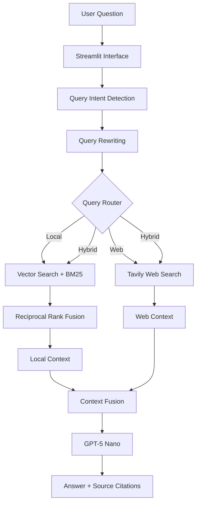

# 💊 PharmacologyGPT

**A hybrid RAG assistant for pharmacology and drug safety — combining textbook knowledge with live regulatory data, with full source attribution.**

[](https://pharmacologygpt.streamlit.app)
[](https://github.com/marufasumi/PharmacologyGPT-RAG/releases)


---

## Overview

Pharmacology questions fall into two camps: stable textbook knowledge (mechanisms, interactions) and time-sensitive information (FDA warnings, new trial data). **PharmacologyGPT** detects query intent and routes each question to the right retrieval path — local, web, or both — then generates a cited answer from the fused context.

This project demonstrates end-to-end RAG engineering: retrieval, routing, source attribution, testing, release management, and cloud deployment.

## Key Features

- **Hybrid retrieval** — ChromaDB vector search + BM25, combined via Reciprocal Rank Fusion
- **Smart routing** — query intent detection and rewriting decide between Local, Web, or Hybrid paths
- **Live web search** — real-time FDA/clinical updates via Tavily
- **Source-cited answers** — generated with GPT-5 Nano
- **Large knowledge base** — 17,879 indexed chunks from 5 pharmacology references (3,081 pages)
- **Extensible** — upload PDFs to grow the local knowledge base
- **Production-ready** — modular LangChain architecture, tested, deployed on Streamlit Cloud

## Architecture



## Tech Stack

| Layer | Technology |
|---|---|
| Language | Python 3.13 |
| RAG Framework | LangChain |
| Interface | Streamlit |
| Vector Database | ChromaDB |
| Keyword Retrieval | BM25 |
| Fusion Strategy | Reciprocal Rank Fusion |
| Embeddings | OpenAI `text-embedding-3-small` |
| Language Model | OpenAI GPT-5 Nano |
| Web Search | Tavily |
| PDF Processing | PyPDF |
| Deployment | Streamlit Community Cloud |

## Try It

**Live app:** [pharmacologygpt.streamlit.app](https://pharmacologygpt.streamlit.app)

| Type | Example |
|---|---|
| Local | "What is the mechanism of action of metformin?" |
| Web | "What is the latest FDA warning for semaglutide?" |
| Hybrid | "Compare warfarin interactions with current prescribing recommendations." |

## Quick Start

```bash
git clone https://github.com/marufasumi/PharmacologyGPT-RAG.git
cd PharmacologyGPT-RAG
python -m venv .venv && source .venv/bin/activate   # Windows: .venv\Scripts\activate
pip install -r requirements.txt
```

Create a `.env` file:

```env
OPENAI_API_KEY=your_openai_api_key
TAVILY_API_KEY=your_tavily_api_key
VECTOR_ARCHIVE_URL=https://github.com/marufasumi/PharmacologyGPT-RAG/releases/download/v1.4.0/pharmacology_vector.tar.gz
```

Run it:

```bash
streamlit run app.py
```

## Testing

```bash
pytest -v
python -m test.test_routed_context
python -m test.test_routed_answer
```

## Project Structure

```text
PharmacologyGPT-RAG/
├── app.py                  # Streamlit application
├── rag.py                  # RAG orchestration and answer generation
├── router.py                # Local, web, and hybrid routing
├── query_intent.py          # Query intent classification
├── query_rewriter.py        # Retrieval-focused query rewriting
├── hybrid_retriever.py       # Vector + BM25 retrieval with RRF
├── context_fusion.py         # Local and web context fusion
├── web_search.py            # Tavily web search integration
├── vector_store.py          # Shared Chroma vector store
├── vector_db_manager.py      # Release asset download and extraction
├── pdf_utils.py              # PDF ingestion utilities
├── build_vector_db.py        # Vector database construction
├── inspect_vector_db.py      # Vector database inspection
├── test/                    # Retrieval, routing, end-to-end tests
├── requirements.txt
└── .env.example
```

## Deployment

Deployed on **Streamlit Community Cloud** from `main` (`app.py`, Python 3.13). On first startup, the app downloads a prebuilt Chroma vector database from the **v1.4.0 GitHub Release**, so no local rebuild is required.

**Current release:** `v1.4.0 — Deployment-Ready Hybrid RAG`

## Disclaimer

This is an educational and portfolio project. It does not provide medical advice, diagnosis, or treatment recommendations. Verify drug-related decisions with official prescribing information and a qualified healthcare professional.

## Author

**Marufa Sultana Sumi**

[](https://www.linkedin.com/in/marufasumi/)
[](https://github.com/marufasumi)

## License

MIT License.

---

⭐ If this project is useful, consider starring the repository.
