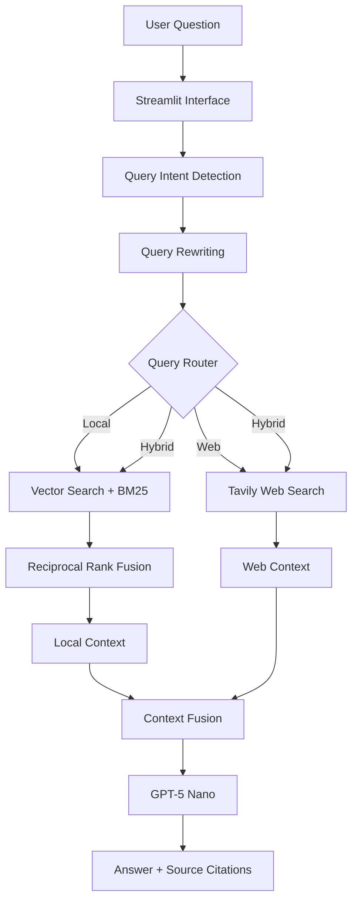

Library
/
RAG_APPLICATION
/
README_professional.md


# 💊 PharmacologyGPT

[](https://pharmacologygpt.streamlit.app)
[](https://github.com/marufasumi/PharmacologyGPT-RAG/releases)

**PharmacologyGPT** is a deployed Hybrid Retrieval-Augmented Generation (RAG) assistant for pharmacology, drug information, FDA safety updates, and clinical knowledge. It combines a local textbook knowledge base with live web search and returns answers with source citations.


---

## Why This Project Matters

Pharmacology questions may require either stable textbook knowledge or current regulatory information. PharmacologyGPT identifies the query intent and routes it to the most appropriate retrieval path:

- **Local retrieval** for textbook-based pharmacology questions
- **Web retrieval** for recent FDA warnings, safety updates, and clinical developments
- **Hybrid retrieval** when both local and current evidence are useful

The application demonstrates end-to-end RAG engineering, including retrieval, routing, source attribution, persistent storage, testing, release management, and cloud deployment.

## Key Highlights

- Hybrid retrieval using **ChromaDB vector search + BM25**
- Reciprocal Rank Fusion for combining retrieval results
- Intelligent routing across **Local, Web, and Hybrid** paths
- Query intent detection and query rewriting
- Live web search through Tavily
- Source-aware answer generation with GPT-5 Nano
- Persistent knowledge base with **17,879 indexed chunks**
- PDF upload support for extending the local knowledge base
- Modular LangChain architecture with lazy initialization
- Public deployment on Streamlit Community Cloud

## System Architecture



## Technology Stack

| Layer | Technology |
|---|---|
| Language | Python 3.13 |
| RAG Framework | LangChain |
| User Interface | Streamlit |
| Vector Database | ChromaDB |
| Keyword Retrieval | BM25 |
| Fusion Strategy | Reciprocal Rank Fusion |
| Embeddings | OpenAI `text-embedding-3-small` |
| Language Model | OpenAI GPT-5 Nano |
| Web Search | Tavily |
| PDF Processing | PyPDF |
| Deployment | Streamlit Community Cloud |

## Knowledge Base

- **5 pharmacology reference PDFs**
- **3,081 pages processed**
- **17,879 indexed chunks**
- Persistent Chroma vector database
- Prebuilt vector database available as a GitHub Release asset

## Example Queries

### Local Knowledge

- What is the mechanism of action of metformin?
- What are the adverse effects of warfarin?
- Explain the pharmacology of insulin.

### Current Web Information

- What is the latest FDA warning for semaglutide?
- What is the latest clinical trial for tirzepatide?
- What are the recent GLP-1 safety updates?

### Hybrid Retrieval

- Compare metformin pharmacology with recent safety evidence.
- Explain Ozempic using textbook knowledge and current FDA guidance.
- Compare warfarin interactions with current prescribing recommendations.

## Project Structure

```text
PharmacologyGPT-RAG/
├── app.py                    # Streamlit application
├── rag.py                    # RAG orchestration and answer generation
├── router.py                 # Local, web, and hybrid routing
├── query_intent.py           # Query intent classification
├── query_rewriter.py         # Retrieval-focused query rewriting
├── hybrid_retriever.py       # Vector + BM25 retrieval with RRF
├── context_fusion.py         # Local and web context fusion
├── web_search.py             # Tavily web search integration
├── vector_store.py           # Shared Chroma vector store
├── vector_db_manager.py      # Release asset download and extraction
├── pdf_utils.py              # PDF ingestion and vector store utilities
├── build_vector_db.py        # Initial vector database construction
├── inspect_vector_db.py      # Vector database inspection
├── test/                     # Retrieval, routing, and end-to-end tests
├── requirements.txt
├── .env.example
└── README.md
```

## Quick Start

### 1. Clone the repository

```bash
git clone https://github.com/marufasumi/PharmacologyGPT-RAG.git
cd PharmacologyGPT-RAG
```

### 2. Create and activate a virtual environment

```bash
python -m venv .venv
source .venv/bin/activate
```

Windows:

```bash
.venv\Scripts\activate
```

### 3. Install dependencies

```bash
pip install -r requirements.txt
```

### 4. Configure environment variables

Create a `.env` file:

```env
OPENAI_API_KEY=your_openai_api_key
TAVILY_API_KEY=your_tavily_api_key
VECTOR_ARCHIVE_URL=https://github.com/marufasumi/PharmacologyGPT-RAG/releases/download/v1.4.0/pharmacology_vector.tar.gz
```

### 5. Run the application

```bash
streamlit run app.py
```

## Testing

Run the complete test suite:

```bash
pytest -v
```

Important end-to-end validations:

```bash
python -m test.test_routed_context
python -m test.test_routed_answer
```

## Deployment

The live application is deployed on Streamlit Community Cloud.

**Application URL:** [https://pharmacologygpt.streamlit.app](https://pharmacologygpt.streamlit.app)

Deployment configuration:

- Repository: `marufasumi/PharmacologyGPT-RAG`
- Branch: `main`
- Main file: `app.py`
- Python: `3.13`
- Secrets: `OPENAI_API_KEY`, `TAVILY_API_KEY`, `VECTOR_ARCHIVE_URL`

The application downloads the prebuilt Chroma database from the **v1.4.0 GitHub Release** during first startup.

## Release

Current stable release: **v1.4.0 — Deployment-Ready Hybrid RAG**

The release includes a prebuilt Chroma vector database so users can run the application without rebuilding all embeddings.

## Disclaimer

This application is an educational and portfolio project. It does not provide medical advice, diagnosis, or treatment recommendations. Drug-related decisions should be verified using official prescribing information and qualified healthcare professionals.

## Author

**Marufa Sultana Sumi**

[](https://www.linkedin.com/in/marufasumi/)
[](https://github.com/marufasumi)

## License

This project is licensed under the MIT License.

---

⭐ If this project is useful, consider starring the repository.
